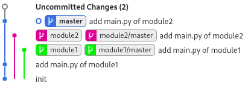

# submodule-split-sample
*Split a big project into submodules*

## Extracting Branches

Split a new branch from your history containing only the subtree rooted at a folder like `module1` and `module2`.

```bash
git subtree split -P module1/ -b module1
git subtree split -P module2/ -b module2
```

For each branch, create (empty) target repository, on GitHub or locally. Add those repos as remotes and push the branches to the `master` of them.

```bash
git init --bare /tmp/module1.git
git remote add module1 /tmp/module1.git
git push module1 module1:master
```



Clone those remotes to new places.

```bash
git clone /tmp/module1.git module1
```

Replace branches with submodules in the original repository.

```bash
git remote rm module1
git rm -r module1
git submodule add url_to_repo module1
git commit -m 'replaced the module1 folder with the module1 submodule'
```

## More Info

- [Git Subtree](https://git-memo.readthedocs.io/en/latest/subtree.html)
- [Splitting a project sub-directory to a new Git repo](https://coderwall.com/p/a3a5xg/splitting-a-project-sub-directory-to-a-new-git-repo)
